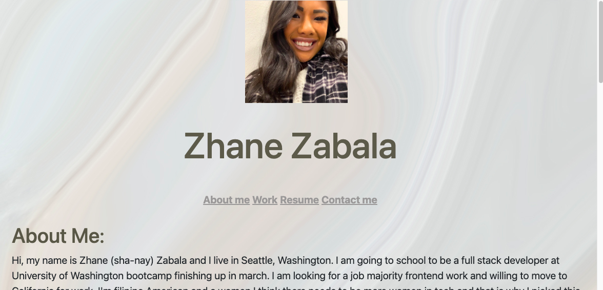
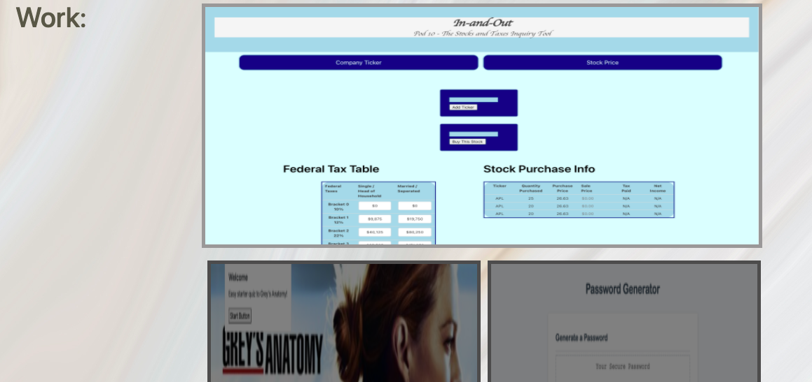
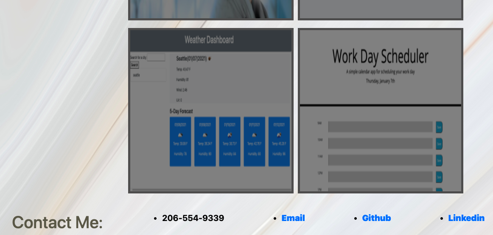

# Portfolio-new

In this assignment I had to update the portfolio. It included header with my name and a nav bar. I created "about me", "work", "resume" and "contact" sections. My work section has my current pictures of my homeworks and projects. My phone number, email, github and linkedin are current. Also, added profile picture and resume is linked to a download PDF.

 

## Table of Contents 
   

* [License](#license)
* [Contribute](#contribute)
* [Tests](#tests)
* [Questions](#questions)

## License:

MIT License

## Contributions:
Zhane Zabala

## Tests:
None

## Questions:
   Github Profile: github.com/zhanez
   Email: zhanezabala@gmail.com
   
  
